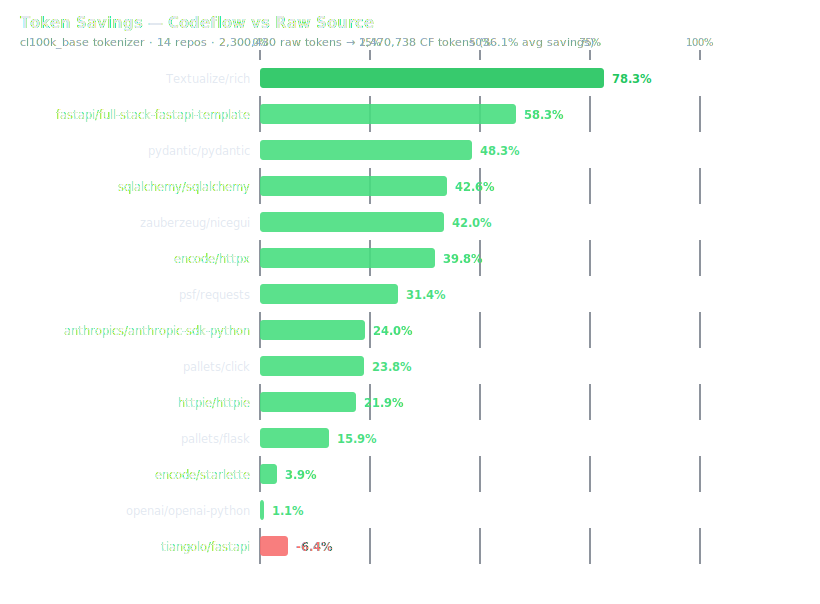
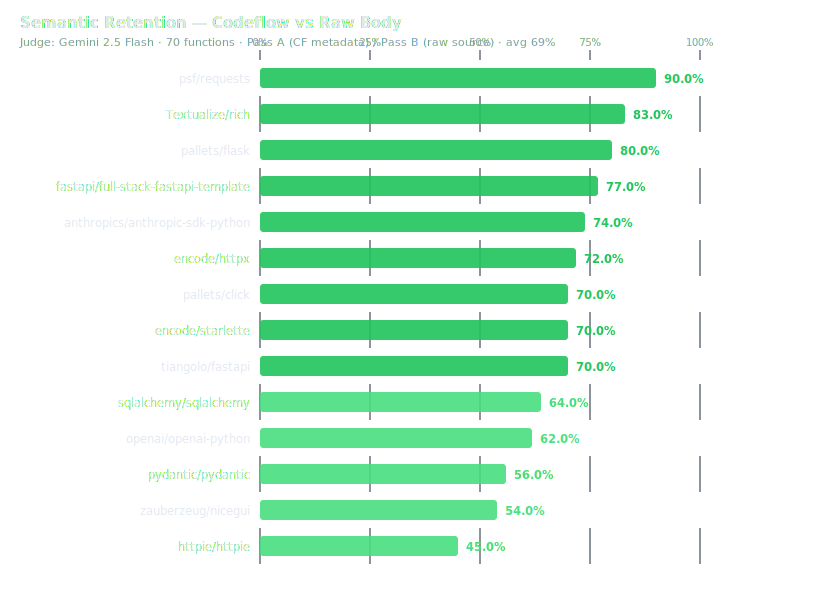

# Codeflow

**Structured repository understanding for LLM agents.**

Codeflow converts any GitHub repository into a compact `ParsedRepo` graph — functions, intents, types, call edges — that an agent can reason over directly, without reading raw source files. It also runs as an interactive tracer: paste a URL, click an intent, watch the full execution chain animate in real time.

---

## Why This Exists

An LLM agent navigating an unfamiliar codebase has two options:

1. Read the raw files — high fidelity, extreme token cost, context window exhaustion on any real repo
2. Receive structured metadata — low token cost, but how much signal actually survives?

Codeflow takes option 2 seriously. Every parser decision — what to extract, what to drop, what to index — is made with agent consumption as the primary constraint. The benchmark below measures the tradeoff empirically.

---

## How It Works

```
GitHub URL → Tree-sitter AST → ParsedRepo JSON → agent context
                                      ↓
                             intent graph + call edges
                                      ↓
                        click intent → animated trace (Sim / OTel / Live)
```

The parser extracts every function with its signature, type classification, docstring, return type, and outbound calls. Intent detection finds every user-facing action — API routes, form handlers, CLI commands, class API entry points — and maps each to its call chain. The output is a single structured JSON object an agent can consume in one shot.

---

## Three Trace Modes

| Mode | What it does | Requirement |
|------|-------------|-------------|
| **Sim** | Walks the static call graph; generates a synthetic trace | Any public GitHub URL |
| **OTel** | Receives real spans from a running service | OTel SDK pointed at Codeflow |
| **Live** | Attaches `sys.settrace` to a local process; captures real I/O | Local repo + run command |

---

## Quick Start

**Prerequisites:** Python 3.11+, Node 18+

```bash
# One command
./scripts/dev_local.sh
```

```bash
# Manual
python3 -m venv .venv && source .venv/bin/activate
pip install -r backend/requirements.txt
uvicorn backend.main:app --reload --host 127.0.0.1 --port 8001

# New terminal
cd frontend && npm install && npm run dev
```

Open `http://localhost:5173`, paste a GitHub repo (e.g. `tiangolo/fastapi`), hit **Parse**.

---

## Environment Variables

All optional. Codeflow runs fully offline in Sim mode.

| Variable | Description |
|----------|-------------|
| `GITHUB_TOKEN` | GitHub PAT — raises rate limit from 60 → 5,000 req/hr |
| `ANTHROPIC_API_KEY` | Enables AI fix suggestions (opt-in, never called automatically) |
| `OTEL_EXPORTER_OTLP_ENDPOINT` | OTel collector endpoint for real span ingestion |
| `DATABASE_URL` | Postgres connection string for trace persistence |

```bash
# .env (gitignored)
GITHUB_TOKEN=ghp_...
ANTHROPIC_API_KEY=sk-ant-...
```

---

## Benchmark — Codeflow as Agent Context

> Full results: [`benchmark/FINAL_BENCHMARK_REPORT.md`](benchmark/FINAL_BENCHMARK_REPORT.md)
> Run: 2026-03-30 · 14 repos · 15,000+ functions · 70 judged · Judge model: Gemini 2.5 Flash

### Setup

We measure three things independently:

- **Token efficiency** — raw source token count vs Codeflow `ParsedRepo` token count, via `tiktoken cl100k_base` (GPT-4/Claude proxy, ±5%)
- **Comprehension quality** — ground truth extracted via `ast.walk` + regex; measures function recall, return type accuracy, route detection, docstring coverage
- **Semantic retention** — for 5 representative functions per repo, Gemini 2.5 Flash scores a description generated from CF metadata (Pass A) and a description generated from the raw source body (Pass B), both evaluated against the actual source (meta-judge). Retention = Pass A score / Pass B score × 100.

Gemini 2.5 Flash was selected as judge specifically to avoid circularity — Claude optimised the Codeflow output format; a different model judges whether that format preserves understanding.

---

### Pass 1 — Token Efficiency



| Repo | Category | Raw | CF | Saved | ×  |
|------|:--------:|----:|---:|:-----:|:--:|
| `Textualize/rich` | Library | 292,337 | 63,449 | **78.3%** | 4.61× |
| `fastapi/full-stack-fastapi-template` | App | 75,035 | 31,286 | **58.3%** | 2.40× |
| `pydantic/pydantic` | Library | 380,113 | 196,655 | **48.3%** | 1.93× |
| `zauberzeug/nicegui` | App | 81,128 | 47,034 | **42.0%** | 1.72× |
| `sqlalchemy/sqlalchemy` | Library | 281,448 | 161,589 | **42.6%** | 1.74× |
| `encode/httpx` | SDK | 134,082 | 80,663 | **39.8%** | 1.66× |
| `psf/requests` | SDK | 85,992 | 58,957 | **31.4%** | 1.46× |
| `anthropics/anthropic-sdk-python` | SDK | 191,843 | 145,706 | **24.0%** | 1.32× |
| `pallets/click` | CLI | 166,675 | 126,972 | **23.8%** | 1.31× |
| `httpie/httpie` | CLI | 119,789 | 93,546 | **21.9%** | 1.28× |
| `pallets/flask` | Framework | 135,633 | 114,082 | **15.9%** | 1.19× |
| `encode/starlette` | Framework | 141,009 | 135,492 | **3.9%** | 1.04× |
| `openai/openai-python` | SDK | 183,840 | 181,780 | **1.1%** | 1.01× |
| `tiangolo/fastapi` | Framework | 31,506 | 33,527 | **-6.4%** | 0.94× |
| **Total** | | **2,300,430** | **1,470,738** | **36.1%** | **1.56×** |

```
  Textualize/rich                      78%  ████████████████████░░░░░
  fastapi/full-stack-fastapi-template  58%  ███████████████░░░░░░░░░░
  pydantic/pydantic                    48%  ████████████░░░░░░░░░░░░░
  sqlalchemy/sqlalchemy                43%  ███████████░░░░░░░░░░░░░░
  zauberzeug/nicegui                   42%  ███████████░░░░░░░░░░░░░░
  encode/httpx                         40%  ██████████░░░░░░░░░░░░░░░
  psf/requests                         31%  ████████░░░░░░░░░░░░░░░░░
  anthropics/anthropic-sdk-python      24%  ██████░░░░░░░░░░░░░░░░░░░
  pallets/click                        24%  ██████░░░░░░░░░░░░░░░░░░░
  httpie/httpie                        22%  █████░░░░░░░░░░░░░░░░░░░░
  pallets/flask                        16%  ████░░░░░░░░░░░░░░░░░░░░░
  encode/starlette                      4%  █░░░░░░░░░░░░░░░░░░░░░░░░
  openai/openai-python                  1%  ░░░░░░░░░░░░░░░░░░░░░░░░░
  tiangolo/fastapi                     -6%  (parse overhead > body savings)
```

Compression correlates with docstring density, test file volume, and comment ratio. Framework internals (FastAPI, Starlette) are near-parity because their source *is* the semantics — stripping the body strips the signal.

---

### Pass 2 — Comprehension Quality (Ground Truth)

| Metric | Result |
|--------|--------|
| Function recall | **100%** across all 14 repos |
| Return type accuracy | **100%** |
| Route detection | 50–100% (framework pattern–dependent) |
| Docstring coverage | 3–52% (avg 17%) |
| Total intents extracted | 3,869 |

Zero missed functions across 15,000+ ground-truth entries. Route recall varies because some frameworks use non-decorator routing patterns (class-based views, `include_router` without `path=`) that require deeper AST traversal.

---

### Pass 3 — Semantic Retention (LLM Judge)



| Repo | CF | Raw | Retention | Grade |
|------|:--:|:---:|:---------:|:-----:|
| `psf/requests` | 7.0 | 7.8 | **90%** | A |
| `Textualize/rich` | 6.8 | 8.2 | **83%** | A |
| `pallets/flask` | 7.2 | 9.0 | **80%** | A |
| `fastapi/full-stack-fastapi-template` | 7.2 | 9.4 | **77%** | B+ |
| `anthropics/anthropic-sdk-python` | 7.0 | 9.4 | **74%** | B+ |
| `encode/httpx` | 6.8 | 9.4 | **72%** | B+ |
| `encode/starlette` | 6.2 | 8.8 | **70%** | B+ |
| `pallets/click` | 6.6 | 9.4 | **70%** | B+ |
| `tiangolo/fastapi` | 7.0 | 10.0 | **70%** | B+ |
| `sqlalchemy/sqlalchemy` | 5.6 | 8.8 | **64%** | B |
| `openai/openai-python` | 6.0 | 9.6 | **62%** | B |
| `pydantic/pydantic` | 5.6 | 10.0 | **56%** | C |
| `zauberzeug/nicegui` | 5.2 | 9.6 | **54%** | C |
| `httpie/httpie` | 3.8 | 8.4 | **45%** | D |
| **Average** | **6.3** | **9.1** | **69%** | **B** |

**By category:**

| Category | Repos | Retention | Interpretation |
|----------|:-----:|:---------:|----------------|
| Python Frameworks | 3 | **73%** | Medium-density; typed signatures carry intent |
| Python SDKs / Libraries | 4 | **74%** | Strong typing compensates for missing body |
| Python App Code | 2 | **65%** | Routes captured; business rules need body |
| Mixed / Large Libraries | 3 | **67%** | Variable — docstring density is the key factor |
| CLI Tools | 2 | **58%** | Command structure captured; branching logic opaque |

**Interpretation:**

At 69% average retention with 36% token savings, the tradeoff is real and measurable. The right frame is task-type:

- **Navigation tasks** ("which function handles password reset?", "what routes does this service expose?"): CF metadata is sufficient. 100% function recall and the intent index answer these directly.
- **Behavioural tasks** ("does this prevent SQL injection?", "what happens when the token is expired?"): raw body wins. CF misses implementation-level constraints — security checks, error conditions, invariants — that aren't expressed in signatures.
- **The docstring effect**: Functions with docstrings score ~2 points higher in CF pass. The single highest-leverage improvement is adding docstrings to your source; Codeflow surfaces them; agents read them.

**Verdict distribution across 70 judged functions:**

```
  B_clearly_better    57/70  (81%)  — raw body provides significantly more understanding
  A_adequate           2/70  ( 3%)  — CF metadata was sufficient on its own
  roughly_equal        0/70  ( 0%)  — tied
  (11 ties/errors excluded from distribution)
```

---

### Reproducing the Benchmark

```bash
pip install tiktoken tree-sitter tree-sitter-python tree-sitter-javascript google-generativeai

GEMINI_API_KEY=... GITHUB_TOKEN=... python -m benchmark.final_benchmark
# → benchmark/FINAL_BENCHMARK_REPORT.md
```

The benchmark script is `benchmark/final_benchmark.py`. It fetches each repo from GitHub, runs the Codeflow parser locally, computes token counts with tiktoken, extracts ground truth with `ast.walk`, then calls Gemini 2.5 Flash for the 3-pass judge evaluation. No other external services required.

---

## ParsedRepo Schema

The output of the parser is a single `ParsedRepo` object:

```python
class ParsedFunction(BaseModel):
    id: str                    # Stable short hash
    name: str
    file: str
    type: FunctionType         # route | handler | service | db | auth | util | component | hook | other
    params: list[Param]        # name, type, direction (in/out)
    line: int
    return_type: str           # Extracted from type annotation
    docstring: str             # First line of docstring / JSDoc
    calls: list[str]           # Outbound call targets

class ParsedRepo(BaseModel):
    schema_version: str
    repo: str                  # owner/repo
    branch: str
    functions: list[ParsedFunction]
    intents: list[Intent]      # User-facing actions mapped to handler_fn_id
    edges: list[Edge]          # Call graph edges (source → target)
    fn_type_index: dict        # { "route": [...ids], "handler": [...ids], ... }
    file_index: dict           # { "path/to/file.py": [...ids], ... }
    file_count: int
    parsed_at: str
```

`fn_type_index` and `file_index` let an agent answer "show me all routes" or "what functions are in auth.py" in O(1) without scanning the full function list.

---

## Stack

| Layer | Tech |
|-------|------|
| Backend | FastAPI, Pydantic v2, Tree-sitter, NetworkX |
| Frontend | React 18, TypeScript, Zustand, React Flow, ELK.js |
| Tracing | OpenTelemetry, Python `sys.settrace` |
| Tokenizer | `tiktoken cl100k_base` (benchmark only) |
| Infra (optional) | OTel Collector, Postgres, Docker Compose |

---

## API Reference

```
GET  /intents?repo={owner/repo}          List all detected intents
GET  /occurrences?repo=...&intent_id=... Get call chain for an intent
POST /trace/start                        Start a trace session
POST /trace/ingest                       Ingest OTel spans
GET  /trace/{session_id}                 Fetch trace events
POST /fix                                Request AI fix suggestion (opt-in)
DELETE /cache/{repo}                     Clear cached parse for a repo
GET  /telemetry/status                   OTel connection status
WS   /ws/trace/{session_id}             Live trace event stream
```

---

## Repo Layout

```
backend/
  main.py              FastAPI app + routes
  parser/              GitHub fetch, AST parsing, graph builder
  models/              Pydantic schemas (ParsedRepo, Intent, TraceEvent)
  tracer/              Simulator, OTel bridge, Python sys tracer
  ai/                  Fix suggester (Anthropic, opt-in)

frontend/
  src/
    components/        FlowCanvas, IntentPanel, TracePanel, TopBar
    store/             Zustand state
    hooks/             API + WebSocket hooks

benchmark/
  final_benchmark.py   14-repo combined benchmark (token + quality + judge)
  FINAL_BENCHMARK_REPORT.md
```

---

## Supported Patterns

| Language | Detected |
|----------|----------|
| Python / FastAPI | `@app.get/post/put/delete`, `@router.*` |
| Python / Flask | `@app.route()`, blueprint routes |
| Python / CLI | `@click.command()`, `argparse` subcommands, `ArgumentParser` |
| Python / Class APIs | Public methods on exported classes |
| TypeScript / React | `onClick`, `onSubmit`, `onChange`, `onKeyDown` handlers |
| Next.js | `'use server'` directives, server actions |

---

## Keyboard Shortcuts

| Key | Action |
|-----|--------|
| `Space` | Play / pause trace playback |
| `R` | Reset active trace |
| `F` | Fit graph to view |

---

## Notes

- **No data leaves your machine in Sim mode.** The only external call is GitHub's public API.
- **AI fixes are opt-in.** `ANTHROPIC_API_KEY` is never called automatically — only when you explicitly request a fix suggestion.
- **OTel mode** accepts spans via `POST /trace/ingest` even without a running collector. It falls back to simulation when no spans arrive within the session window.

---

Built by [Thirdwheel](https://github.com/thirdwheel-dev).
